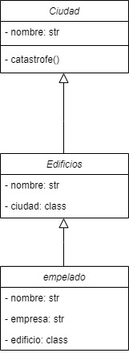

# Agregacion-Composicion_POO
<h1 align="center">Agregación y Composición</h1>

<h3 align="center">Autores de este proyecto:</h3>

1. [@xavitheforce](https://github.com/Xavitheforce)
---
En este [repositorio](https://github.com/Xavitheforce/Agregacion-Composicion_POO) quedan resueltos los ejercicios de agregación y composición POO.
***
## Índice
1. [Catastrofe](#id1)
3. [Inmortal](#id2)
3. [Alternativa](#id3)
***

## Ejercicio 1: Catástrofe<a name="id1"></a>

En este ejercicio he definido los distintos elementos requeridos(ciudades, empleados, edificios), y los he agrupado en un diccionario de diccionarios y listas. El código, en función de la ciudad destruida, actualiza el diccionario para emitir el estado actual de las ciudades de la empresa YooHoo!

El código empleado para resolverlo es el siguiente:

```python
from getopt import gnu_getopt
from re import X

class ciudad:
    def __init__(self, nombre):
        self.nombre = nombre
    
    def catastrofe(self):
        print("La ciudad "+str(self.nombre)+" ha sido destruida.")
        for persona in empleados:
            name = persona.edificio.ciudad.nombre
            if name == self.nombre:
                print(str(persona.nombre)+" ha quedado desempleado por la catastrofe.")
                estatus["Sedes YooHoo!"][str(name)]["edificios"][str(persona.edificio.nombre)][0][1] = "Desempelado"
                print("El edificio "+str(persona.edificio.nombre)+" ha sido destruido.")
                estatus["Sedes YooHoo!"][str(name)]["edificios"][str(persona.edificio.nombre)][1] = False
                estatus["Sedes YooHoo!"][str(name)]["estado"] = "Destruida"
        print(estatus)


class empleado:
    def __init__(self, nombre, empresa, edificio):
        self.nombre = nombre
        self.empresa = empresa
        self.edificio = edificio

class edificio:
    def __init__(self, nombre, ciudad):
        self.nombre = nombre
        self.ciudad = ciudad

ciudad1 = ciudad("Nueva York")
ciudad2 = ciudad("Los Angeles")
A = edificio("A", ciudad1)
B = edificio("B", ciudad1)
C = edificio("C", ciudad2)
e1 = empleado("Martin", "YooHoo!", A)
e2 = empleado("Xing", "YooHoo!", B)
e3 = empleado("Salim", "YooHoo!", C)
empleados = [e1, e2, e3]
estatus = {"Sedes YooHoo!":{str(ciudad1.nombre): {"estado": "operativa", "edificios": {str(A.nombre): [[str(e1.nombre), "Empleado"], True], str(B.nombre): [[str(e2.nombre), "Empleado"], True]}}, str(ciudad2.nombre): {"estado": "operativa", "edificios": {str(C.nombre): [[str(e3.nombre), "Empleado"], True]}}}}

def iniciar():
    print(estatus)
    print("Se acerca la destruccion del mundo. ¿Que ciudad caerá primero?,")
    genocidio = int(input("¿Nueva York(1) o Los Angeles(2)?: "))
    c = 0
    if genocidio == 1:
        ciudad1.catastrofe()
        c = 1
    elif genocidio == 2:
        ciudad2.catastrofe()
        c = 2
    else:
        print("Seleccione una opción válida")
        iniciar()
    print("¿Quiere destruir la otra ciudad?(1 = Sí)")
    seguir = int(input("Por favor introduzca un número: "))
    if seguir == 1:
        if c == 1:
            ciudad2.catastrofe()
        elif c == 2:
            ciudad1.catastrofe()
    else:
        print("Pronto caerá todo...")
```
Su UML es el siguiente:

<br>

<br>

## Ejercicio 2: Inmortal<a name="id2"></a>

El código comentado y resuelto es el siguiente:
 
 ```python
class Yin: pass
class Yang:
    def __del__(self): 
        print("Yang destruido") 
 
yin = Yin() 
yang = Yang() 
yin.yang = yang
 
print(yang)
#>>> <__main__.Yang object at 0x1011da828> 
print(yang is yin.yang) 
#>>> True
del(yang)
print("?")
print("codigo destruido(porque no ejecuta??)")
#>>> ?
#Yang destruido

#El mensaje aparece despues de la interrogación por culpa de la variable yin.yang
#Esta variable traspasa los metodos de la clase yin(el pass) a la clase yang (yin.atributo = yang . En este caso yin.yang = yang)
#Por culpa de la clase yin, las funciones de la clase yang no se ejecutan hasta el final del codigo(por el pass)
#Es por esto que "Yang destruido" aparece al final del todo sin importar que programes, pero aparece en el orden correcto al eliminar el yin.yang

class Yin: pass
class Yang:
    def __del__(self): 
        print("Yang destruido") 
 
yin = Yin() 
yang = Yang() 
yin.yang = yang

yin.yang = None
print("\nAhora Yang se destruirá antes de la interrogación:\n")
print(yang)
#>>> <__main__.Yang object at 0x1011da828> 
print(yang is yin.yang) 
#>>> True
del(yang)
print("?")
print("codigo destruido, ahora en el orden correcto")
print("\nPara ver el por qué del código revisar código comentado.")
#>>> ?
#Yang destruido
```
(Al ser una lectura de código no tiene UML)


## Ejercicio 3: Alternativa<a name="id3"></a>

Este ejercicio es una modificación de uno resuelto en una entrega grupal pasada. Simplemente he agrupado todo en una misma clase llamada Interfaz_cristal.

El código empleado para resolverlo es el siguiente:
 
 ```python
from ast import In

class Interfaz_cristal():

  casa = {}
  orientaciones = ['NORTE', 'SUR', 'ESTE', 'OESTE']

  def Paredes(self, orientacion):
    for i in range(len(orientacion)):
      nombre = orientacion[i]
      Interfaz_cristal.casa[nombre] = {
          'ventanas': {},
      }
    print(Interfaz_cristal.casa)
    Interfaz_cristal().Ventanas([['NORTE', 0.5, ''], ['SUR', 1, ''], ['ESTE', 2, ''], ['OESTE', 1, '']])
  def Ventanas(self, ventanas):
    for i in range(len(ventanas)):
      nombre = ventanas[i][0]
      Interfaz_cristal.casa[nombre]['ventanas'] = {
        'superficie': ventanas[i][1],
        'proteccion': ventanas[i][2]
      }
    print(Interfaz_cristal.casa)
    Interfaz_cristal().Superficie()
  def Superficie(self):
    total = 0
    for i in range(len(Interfaz_cristal.orientaciones)):
      total += Interfaz_cristal.casa[Interfaz_cristal.orientaciones[i]]['ventanas']['superficie']
    print('Superficie acristalada: ' + str(total))
  def ParedCortina(self, orientacion, tamaño):
    Interfaz_cristal.casa[orientacion]['ventanas']['superficie'] += tamaño
    print(Interfaz_cristal.casa)
  def ComprobarProteccion(self, orientacion):
    if Interfaz_cristal.casa[orientacion]['ventanas']['proteccion'] != '':
      print('Protección en regla.')
    else:
      print('Protección obligatoria no presente.')

```
Su UML es el siguiente:

<br>

<br>
